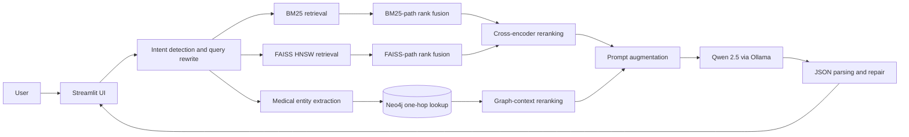

# SympScan

**A local-first medical-information RAG prototype combining BM25, FAISS, Neo4j, cross-encoder reranking, and Ollama generation.**

[](https://github.com/Dochikhoa2006/SympScan-Advanced-Medical-RAG-Knowledge-Graph-System/actions/workflows/repository-quality.yml)


SympScan is an end-to-end exploration of hybrid retrieval and graph-enriched generation over a public symptom-to-disease dataset. It joins lexical search, dense vector search, structured one-hop graph context, local language models, and a Streamlit interface in one inspectable pipeline.

> [!IMPORTANT]
> SympScan is an educational software prototype. It is not a medical device, has not been clinically validated, and must not be used for diagnosis, emergency triage, prescribing, or as a substitute for a qualified healthcare professional.

## What this project demonstrates

- A PySpark and Pandas preprocessing pipeline that combines six source tables into structured and flattened disease records.
- Dual retrieval with BM25 for lexical matching and a normalized FAISS HNSW index for semantic similarity.
- Reciprocal-rank fusion and `ms-marco-MiniLM-L-6-v2` cross-encoder reranking.
- Neo4j storage for disease, medication, precaution, and source-chunk relationships.
- LLM-assisted intent detection, standalone query rewriting, entity extraction, structured generation, and JSON repair.
- Local inference through Ollama, a Streamlit chat interface, and Docker Compose orchestration.

The local dataset snapshot contains 100 disease profiles, 96,088 symptom-profile rows, and 230 symptom indicator columns. The built retrieval snapshot contains 12,947 chunks represented by 384-dimensional embeddings.

## Architecture



The graph enriches retrieval with dataset-derived relationships; it is not an external source of clinically verified facts. See [Architecture](docs/ARCHITECTURE.md) for the offline build path, online sequence, graph schema, and default feature flags.

## Technology stack

| Layer | Technology | Role |
|---|---|---|
| Data preparation | Pandas, PySpark, Parquet | Normalize and assemble disease records |
| Sparse retrieval | BM25Okapi, NLTK | Match exact and inflected terminology |
| Dense retrieval | Sentence Transformers, FAISS HNSW | Retrieve semantically related chunks |
| Reranking | MS MARCO CrossEncoder | Score query–chunk relevance |
| Graph context | Neo4j, APOC Core/Extended | Retrieve relationships and restore the graph snapshot |
| LLM workflow | LangChain, Ollama, Qwen 2.5 | Rewrite, extract, generate, and summarize |
| Interface | Streamlit | Provide the interactive chat experience |
| Runtime | Docker, Docker Compose | Run the application and Neo4j services |

## Repository layout

The executable modules intentionally remain at the repository root. Existing imports, relative artifact paths, and serialized search objects depend on these module names and locations.

```text
.
├── Inference.py                       # Streamlit entry point
├── Augmented_Generation.py            # RAG orchestration and response handling
├── Retrieval.py                       # Hybrid and graph retrieval
├── PreRetrival_and_PostRetrieval.py   # Query and context processing
├── Hybrid_Dual_Indexing.py            # BM25 and semantic indexing
├── Vector_Database.py                 # FAISS persistence and search
├── Knowledge_Graph.py                 # Neo4j construction and retrieval
├── Raw_Dataset_PreProcess.py          # CSV-to-Parquet preprocessing
├── FAISS_Database/                    # FAISS index files
├── neo4j.cypher                       # Neo4j snapshot managed by Git LFS
├── Dockerfile
├── docker-compose.yml
├── requirements.txt
├── docs/                              # Architecture, setup, artifacts, and safety
└── .github/                           # CI and collaboration templates
```

## Quick start

### Prerequisites

- Git and [Git LFS](https://git-lfs.com/)
- Python 3.11
- Docker Desktop with Docker Compose
- [Ollama](https://ollama.com/) running on the host
- The locally generated retrieval artifacts described below

### 1. Clone the repository

```bash
git clone https://github.com/Dochikhoa2006/SympScan-Advanced-Medical-RAG-Knowledge-Graph-System.git
cd SympScan-Advanced-Medical-RAG-Knowledge-Graph-System
git lfs install
git lfs pull
```

### 2. Prepare the local artifacts

A fresh clone does not contain every generated model and data artifact. Before application startup, the workspace must contain:

```text
Semantic_Model.pkl
Keyword_Model.pkl
FAISS_Database/index.faiss
FAISS_Database/index.pkl
neo4j.cypher
```

Follow [Setup and reproducibility](docs/SETUP.md) to rebuild the ignored artifacts from the source dataset. Only load pickle/joblib artifacts that you created or obtained from a trusted source.

### 3. Pull the Ollama model

```bash
ollama pull qwen2.5:0.5b-instruct-q5_k_m
```

### 4. Start the services

> [!WARNING]
> The tracked Compose file currently installs APOC Core only, while graph restoration calls `apoc.cypher.runFile`, which is supplied by APOC Extended in current Neo4j releases. Treat the command below as a development definition, not a verified one-command startup, until a compatible Neo4j plus APOC Core/Extended combination is configured and smoke-tested.

Once the required artifacts and compatible Neo4j plugins are available:

```bash
docker compose up --build
```

Open [http://localhost:8501](http://localhost:8501). The first application load can take about a minute while retrieval and reranking resources initialize.

Graph restoration is disabled by default, so graph retrieval requires an already populated Neo4j database. On a dedicated disposable database with compatible APOC Core/Extended installed, set `RESTORE_GRAPH_SNAPSHOT=true` before `docker compose up --build` to restore `neo4j.cypher`; this deletes existing graph data. See [Setup and reproducibility](docs/SETUP.md).

## Build pipeline

When rebuilding from the raw dataset, run the stages in this order:

```bash
python Raw_Dataset_PreProcess.py
python Hybrid_Dual_Indexing.py
python Vector_Database.py
```

Neo4j snapshot construction has additional environment requirements and is documented separately in [Setup and reproducibility](docs/SETUP.md). Artifact provenance, tracking rules, and security considerations are listed in [Data and artifacts](docs/DATA_AND_ARTIFACTS.md).

## Default retrieval behavior

The current default request path enables:

- Intent detection and standalone query rewriting.
- BM25 and FAISS retrieval.
- Reciprocal-rank fusion within each retrieval path.
- Cross-encoder reranking across the combined candidates.
- Exact-name Neo4j lookup and graph-context reranking.
- An abstention response for medical queries when retrieval returns no usable text.
- JSON parsing across at most three generation attempts total: the initial response plus up to two format-repair retries.

Experimental source paths for query expansion, HyDE, chunk ordering, and extractive compression are present, but they are disabled and have not been validated in the default workflow. LLM-produced response and retrieval scores are logged as heuristic telemetry; they are not calibrated probabilities or clinical confidence measures.

## Design decisions and trade-offs

| Decision | Benefit | Trade-off |
|---|---|---|
| Sparse + dense retrieval | Covers exact terms and semantic similarity | Adds index and ranking complexity |
| Local Ollama inference | Keeps inference under local operator control | Requires host setup and sufficient resources |
| One-hop graph enrichment | Makes explicit dataset relationships retrievable | Exact entity matching limits recall |
| Cross-encoder reranking | Reorders candidates using learned relevance scores | Adds startup time and query latency |
| Structured JSON generation | Produces predictable UI fields | Parseability does not guarantee factual correctness |
| Root-level runtime modules | Preserves serialized artifact compatibility | Delays migration to a conventional package layout |

## Safety and current limitations

- The system has no emergency escalation pathway, clinical validation, or regulatory approval.
- The UI shows retrieved passages and graph relationships with each answer, but does not link individual claims to supporting passages.
- Plaintext interaction logging is disabled by default. Set `ENABLE_CHAT_LOGGING=true` only for a controlled local demo; do not enter personal or protected health information.
- Conversation state is per Streamlit session, but the retriever and optional log are shared, so the current implementation is intended for controlled local demonstration rather than multi-user deployment.
- Most generated artifacts and the raw dataset are excluded from normal Git tracking; the FAISS index and Neo4j export are tracked exceptions.
- Automated CI checks source syntax and repository structure; retrieval quality and medical correctness do not yet have benchmark tests.
- Dependencies and the Neo4j container tag are not fully pinned.
- The current Compose definition installs APOC Core but not the APOC Extended procedure used for graph restoration; startup remains unverified on current `neo4j:latest`.
- Compose publishes Neo4j ports broadly and bind-mounts the repository read-write into the app container; use it only in a controlled local development environment.

Read [Safety and limitations](docs/SAFETY_AND_LIMITATIONS.md) before running or extending the project.

## Documentation

- [Architecture](docs/ARCHITECTURE.md)
- [Setup and reproducibility](docs/SETUP.md)
- [Data and artifacts](docs/DATA_AND_ARTIFACTS.md)
- [Safety and limitations](docs/SAFETY_AND_LIMITATIONS.md)
- [Contributing](CONTRIBUTING.md)
- [Security policy](SECURITY.md)

## Roadmap

- Add unit tests for pure retrieval utilities and integration tests with controlled fixtures.
- Add retrieval evaluation with versioned queries, relevance judgments, and measurable metrics.
- Surface chunk-level citations alongside generated answers.
- Introduce explicit retention controls for optional interaction logs.
- Move configuration into validated environment settings and replace demonstration credentials.
- Package the application after providing compatibility migration for existing serialized artifacts.

## Dataset attribution

This project uses the [SympScan – Symptoms to Disease dataset](https://www.kaggle.com/datasets/behzadhassan/sympscan-symptomps-to-disease). The raw CSV files are not tracked, but the repository does distribute derived snapshots: the FAISS index and a Git LFS-managed Neo4j export that contains transformed dataset-derived chunk text. Review the dataset page for its current provenance and usage terms before downloading, using, or redistributing either raw or derived material.

## Citation

Citation metadata is provided in [CITATION.cff](CITATION.cff).

> Do, Chi Khoa (2026). *SympScan: Advanced Medical RAG & Knowledge Graph System*.

## License status

No standalone, versioned software license file is currently included. Earlier repository text referred generally to “CC-BY,” but did not specify a version or complete terms. Until the project owner selects and adds a formal software license, do not assume reuse rights.

## Contact

Chi Khoa Do — [dochikhoa2006@gmail.com](mailto:dochikhoa2006@gmail.com)

Project repository: [Dochikhoa2006/SympScan-Advanced-Medical-RAG-Knowledge-Graph-System](https://github.com/Dochikhoa2006/SympScan-Advanced-Medical-RAG-Knowledge-Graph-System)
