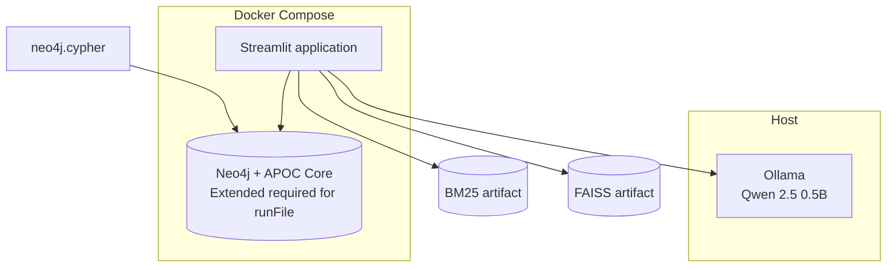
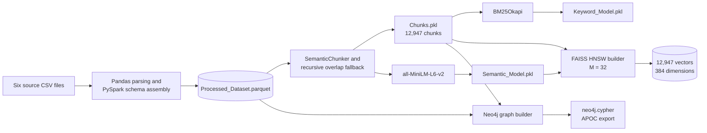
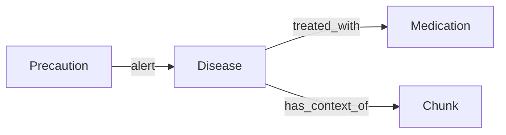

# Architecture

This document describes the behavior of the tracked implementation. It distinguishes the active default path from experimental code paths so the architecture remains auditable.

## System boundary

SympScan is a local-first educational medical-information retrieval prototype. Docker Compose defines the Streamlit application and Neo4j services. Ollama runs separately on the host and is reached from the application container through `host.docker.internal:11434`.



## Offline build pipeline



### Build-stage responsibilities

| Stage | Implementation | Output |
|---|---|---|
| Source normalization | `Raw_Dataset_PreProcess.py` | Flattened and structured Parquet rows |
| Semantic chunking | `Hybrid_Dual_Indexing.py` | Nested LangChain `Document` chunks |
| Sparse indexing | `Hybrid_Dual_Indexing.py` | Serialized BM25 object and flattened chunks |
| Dense indexing | `Vector_Database.py` | FAISS HNSW index and docstore metadata |
| Graph construction | `Knowledge_Graph.py` | Neo4j nodes/relationships and Cypher export |

Semantic chunking uses `all-MiniLM-L6-v2`. A child chunk over 200 whitespace-separated words is split again with a 1,200-character recursive window and 300-character overlap. The same 12,947 chunks back BM25, FAISS, and Neo4j `Chunk` nodes.

## Default online request path

```mermaid
sequenceDiagram
    actor User
    participant UI as Streamlit
    participant RAG as RAG Orchestrator
    participant CP as Context Processor
    participant RT as Retriever
    participant KG as Neo4j
    participant LLM as Ollama / Qwen

    User->>UI: Medical-information question
    UI->>RAG: Raw query
    RAG->>CP: Query and summarized history
    CP->>LLM: Detect intent
    CP->>LLM: Rewrite as standalone query

    RAG->>RT: Hybrid retrieval request
    RT->>RT: BM25 query, top 64
    RT->>RT: FAISS query, top 24
    RT->>RT: Per-path reciprocal-rank fusion, top 10
    RT->>RT: Cross-encoder reranking, combined top 5

    RAG->>CP: Extract entities from processed query
    CP->>LLM: Extract disease and medication entities
    RAG->>RT: Graph retrieval request
    RT->>KG: Exact normalized entity names
    KG-->>RT: Undirected one-hop relationships
    RT->>RT: Linearize and rerank graph context

    RAG->>LLM: Dataset context plus rewritten question
    LLM-->>RAG: Candidate JSON response
    RAG->>RAG: Parse JSON; at most 3 attempts total
    RAG-->>UI: Markdown-formatted result
    UI->>RAG: Run post-response phase
    RAG->>LLM: Generate heuristic scores and history summary
```

The default request uses one rewritten query. Reciprocal-rank fusion therefore ranks and deduplicates candidates inside each retrieval path; it is not combining a large set of active query expansions under the default settings.

## Default and experimental features

| Capability | Source path present | Enabled by default | Status in this repository |
|---|:---:|:---:|---|
| Intent detection | Yes | Yes | Active default path |
| Standalone query rewriting | Yes | Yes | Active default path |
| BM25 retrieval | Yes | Yes | Active default path |
| FAISS retrieval | Yes | Yes | Active default path |
| Reciprocal-rank fusion | Yes | Yes | Active per-path ranking |
| Cross-encoder reranking | Yes | Yes | Active default path |
| Neo4j entity lookup | Yes | Yes | Active exact-name, one-hop path |
| Query expansion | Yes | No | Experimental; not validated here |
| HyDE | Yes | No | Experimental; not validated here |
| Chunk ordering | Yes | No | Experimental; not validated here |
| Extractive compression | Yes | No | Experimental; not validated here |

## Graph model



The tracked graph snapshot contains:

| Graph element | Count |
|---|---:|
| Disease nodes | 100 |
| Medication nodes | 415 |
| Precaution nodes | 347 |
| Chunk nodes | 12,947 |
| `has_context_of` relationships | 12,947 |
| `treated_with` relationships | 646 |
| `alert` relationships | 417 |

Symptoms, diets, and exercises are present in chunk text, not as dedicated graph-node types. Runtime graph retrieval performs exact-name matching followed by an undirected one-hop lookup; it does not perform multi-hop graph reasoning.

## Generation and telemetry

The augmentation prompt combines reranked chunks and linearized graph relationships. Generation requests JSON-shaped output and allows at most three generation attempts total: the initial response plus up to two format-repair retries. The parser does not provide complete JSON Schema validation, and successful parsing does not establish medical correctness.

When `ENABLE_CHAT_LOGGING=true`, the model produces two heuristic scores for logging after a response: response quality and retrieval helpfulness. They are uncalibrated LLM self-assessments rather than probabilities, clinical confidence, or benchmark metrics.

## Startup behavior

`Retriever` loads the serialized semantic and keyword objects, the FAISS store, the cross-encoder, and the Neo4j connection. Snapshot import is disabled by default. When `RESTORE_GRAPH_SNAPSHOT=true`, initialization checks for the snapshot and APOC Extended import procedure, then deletes all nodes and drops existing indexes and constraints before attempting to reload `neo4j.cypher`.

Use a dedicated, disposable development database. Do not point the current implementation at a shared or production Neo4j database.

The tracked Compose definition installs APOC Core through `NEO4J_PLUGINS=["apoc"]`. Current Neo4j releases provide `apoc.cypher.runFile` through APOC Extended, so graph restoration can fail until a compatible Extended plugin is installed and version-matched. The Python classes read `NEO4J_URI` and `OLLAMA_BASE_URL` from the environment, along with `AUTH` for the graph password.

## Compatibility constraint

The root-level module names and artifact locations are part of the current runtime contract. Serialized search objects depend on the original Python class/module resolution, while multiple scripts use root-relative paths. Moving files into a conventional `src/` package without a migration layer can break loading even if the Python source itself is unchanged.

For that reason, the repository has been professionalized additively: documentation, CI, and collaboration files are organized into dedicated directories while application modules remain in place.
