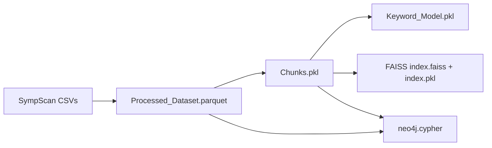

# Data and artifacts

This project separates source code from most raw and generated data. That keeps normal Git history smaller, but it also means artifact provenance and build order must be explicit.

## Source snapshot

The local development snapshot contains:

| Item | Count |
|---|---:|
| Disease records | 100 |
| Symptom-profile rows | 96,088 |
| Symptom indicator columns | 230 |
| Source CSV files | 6 |

The preprocessing loop is driven by `description.csv`. Medication, diet, workout, and precaution rows are matched by row position; symptom profiles are selected by lowercased disease name.

The source comes from the [SympScan – Symptoms to Disease dataset](https://www.kaggle.com/datasets/behzadhassan/sympscan-symptomps-to-disease). Review its current provenance and terms independently from the project code. Although the raw CSVs are ignored, the tracked FAISS index and Git LFS-managed Neo4j export are derived from this source; the Neo4j export contains transformed chunk text from the dataset.

## Artifact inventory

| Path | Purpose | Normal Git status | Required at runtime |
|---|---|---|:---:|
| `SympScan/` | Raw CSV snapshot | Ignored | No |
| `Processed_Dataset.parquet/` | Structured preprocessing output | Ignored | No |
| `Chunks.pkl` | Nested LangChain document chunks | Ignored | No |
| `Keyword_Model.pkl` | BM25 model and flattened chunks | Ignored | Yes |
| `Semantic_Model.pkl` | Embedding/search object | Ignored | Yes |
| `FAISS_Database/index.faiss` | HNSW vector index | Tracked | Yes |
| `FAISS_Database/index.pkl` | Docstore and ID mapping | Ignored | Yes |
| `neo4j.cypher` | Graph snapshot | Git LFS | Yes |
| `Chat_History.log` | Optional local JSONL interaction telemetry | Ignored | Only when `ENABLE_CHAT_LOGGING=true` |

The current FAISS snapshot contains 12,947 vectors with 384 dimensions in an `IndexHNSWFlat` index.

## Lineage



Each derived artifact should be regenerated when its upstream dataset, preprocessing code, chunking configuration, embedding model, or library serialization format changes.

## Trust boundary for serialized files

The application uses `joblib.load` and LangChain FAISS loading with dangerous deserialization enabled. Pickle-compatible formats can execute code while loading.

Only load artifacts that:

- You generated in a controlled environment, or received through a trusted project release channel.
- Match published cryptographic checksums.
- Correspond to the expected source revision and dependency versions.

Never load a `.pkl`, `.joblib`, or FAISS metadata file from an unknown link or an unreviewed pull request.

## Recommended release strategy

For a future reproducible release:

1. Pin and test the dependency environment.
2. Record the dataset version and upstream URL.
3. Rebuild every artifact from a clean workspace.
4. Run retrieval and application smoke tests.
5. Publish large artifacts through Git LFS, a GitHub Release, DVC, or controlled object storage.
6. Publish a checksum manifest, artifact sizes, model identifiers, and the source commit SHA.

Example checksum commands:

```bash
shasum -a 256 Semantic_Model.pkl Keyword_Model.pkl
shasum -a 256 FAISS_Database/index.faiss FAISS_Database/index.pkl
shasum -a 256 neo4j.cypher
```

Do not commit generated binaries merely to make the repository appear self-contained. Choose one deliberate artifact-distribution policy and document it.

## Privacy and retention

When `ENABLE_CHAT_LOGGING=true`, `Chat_History.log` contains raw questions, rewritten queries, retrieved context, responses, and LLM-generated telemetry. Logging is disabled by default. Health-related text may be sensitive even when names are omitted.

The app's “Clear This Session” action clears only that session's in-memory chat. Existing log entries remain on disk until the operator removes or redacts them.

- Do not enter personal or protected health information into the demonstration.
- Do not attach the log to issues or commits.
- Delete or redact local logs before screen sharing, archiving, or transferring the workspace.
- Treat screenshots and terminal output as potentially sensitive.

The log is ignored by Git, and `.dockerignore` prevents the existing local log and `.env` file from entering the Docker build context.
